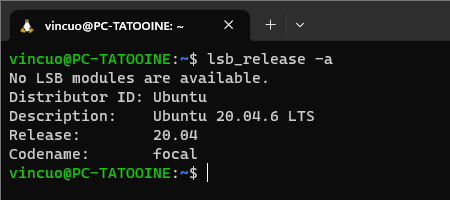
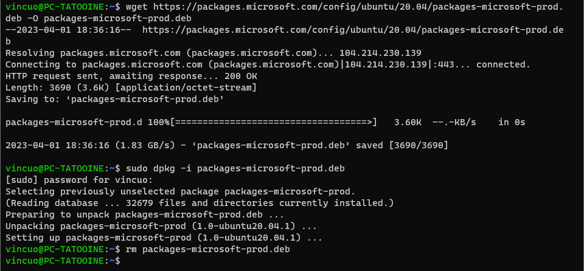
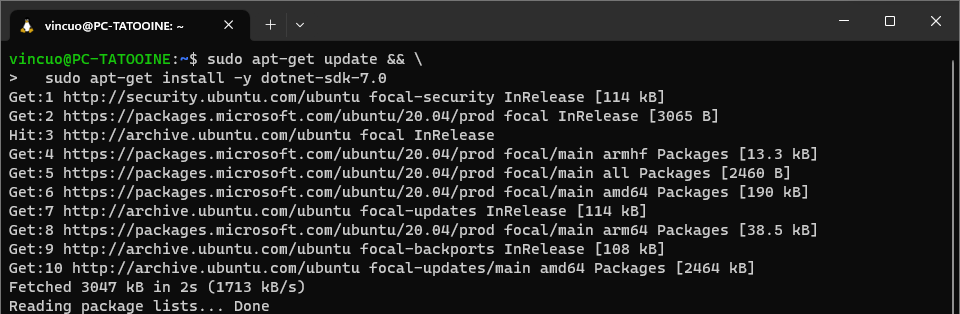
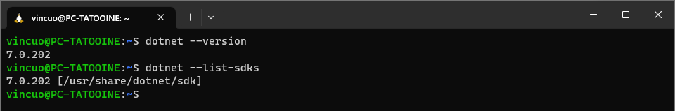
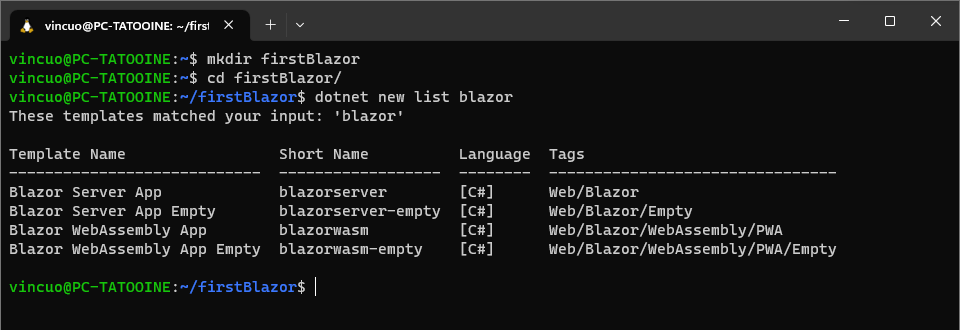
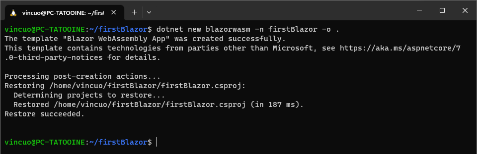
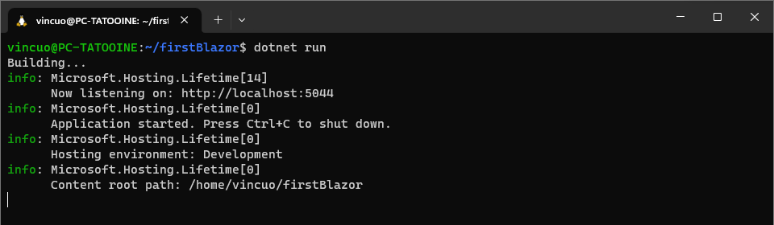
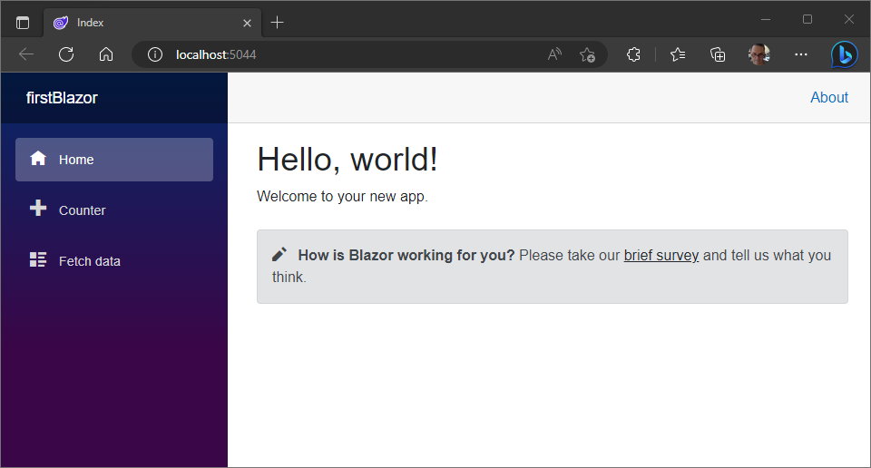

# Develop .NET applications on Ubuntu

Let's configure wsl to get an ubuntu shell in windows 10 or 11

- [Install Linux on Windows with WSL](https://learn.microsoft.com/en-us/windows/wsl/install)

Below you will find other in-depth links, in particular:

- [Set up a WSL development environment](https://learn.microsoft.com/en-us/windows/wsl/setup/environment?source=recommendations)
- [Install the .NET SDK or the .NET Runtime on Ubuntu](https://learn.microsoft.com/en-us/dotnet/core/install/linux-ubuntu)

After Ubuntu installation, you can check from the shell which version you have installed.

```bash
lsb_release -a
```



So my version is 20.04.6 LTS :confused: all fine, there is a guide!

- [Install .NET SDK or .NET Runtime on Ubuntu 20.04](https://learn.microsoft.com/en-us/dotnet/core/install/linux-ubuntu-2004)

## Add the Microsoft package repository

```bash
wget https://packages.microsoft.com/config/ubuntu/20.04/packages-microsoft-prod.deb -O packages-microsoft-prod.deb
sudo dpkg -i packages-microsoft-prod.deb
rm packages-microsoft-prod.deb
```



## Install the SDK

```bash
sudo apt-get update && \
  sudo apt-get install -y dotnet-sdk-7.0
```



## Check .Net version

```bash
dotnet --version
dotnet --list-sdks
```



## Create a new folder and check templates

```bash
mkdir firstBlazor
cd firstBalzor
dotnet new list
```



## Make new App

- [dotnet new](https://learn.microsoft.com/en-us/dotnet/core/tools/dotnet-new)

```bash
dotnet new blazorwasm -n firstBlazor -o .
```



## Fire

- [dotnet run](https://learn.microsoft.com/en-us/dotnet/core/tools/dotnet-run)



> :warning: **Warning** - The port number may vary

## Test

You can do this...
Anyway, *ctrl+click* on the link to open browser.


